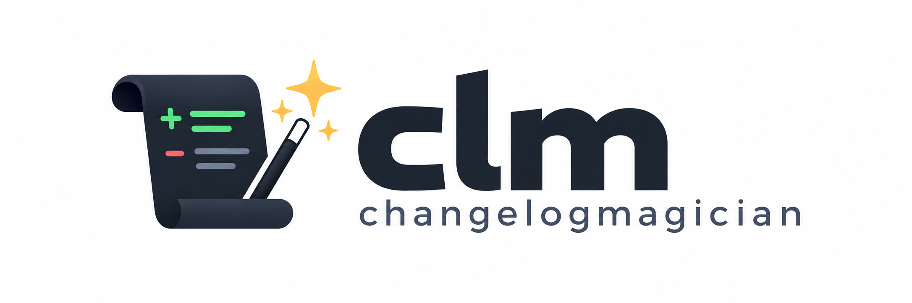

# Change Log Magician



Change Log Magician (`clm`) keeps release notes tidy while your team ships. Write small, merge-friendly Markdown fragments during development; CLM turns them into an audited Keep a Changelog release when it is time to cut.

No shared changelog fights. No guessing the next version. Just a little release magic.

## Install and develop

```bash
mise install
mise run check
go run ./cmd/clm --help
```

The committed `mise.toml` is the source of truth for Go and quality-tool versions.

Build the five downloadable release artifacts locally with an explicit stable or beta tag:

```bash
mise run release-build -- v1.2.3
mise run release-build -- v1.2.3-beta.pr.42.abcdef
mise run release-build-check
```

Artifacts and SHA-256 checksums are written to `dist/`.

## Quick start

```bash
clm init
clm new-minor shell-completions
clm added -m "Add shell completion support"
clm cut --check --require-fragment --base origin/main
clm next-version --json
clm cut
```

Fragments live directly under `changelog.d/`. They use one level heading (`[major]`, `[minor]`, `[patch]`, or `[unreleased]`) and the standard Keep a Changelog categories. Every merge request or pull request must contribute a valid fragment. Use `new-unreleased` for changes that should appear under the persistent root `Unreleased` section without producing a tag by themselves.

`clm cut` creates the changelog/archive commit. A stable cut creates annotated `vX.Y.Z` and `clm/vX.Y.Z` tags but never pushes them. CI must provide credentials only to the post-merge job that pushes those results.

## Pipelines

GitHub Actions and GitLab CI both need a checkout with reachable tags and a target-base revision:

```bash
clm cut --check --require-fragment --base "$BASE_REVISION"
clm next-version --json --prerelease-id "pr.123.$SHORT_SHA"
```

For an unreleased-only change, `next-version` reports no stable version and the pipeline must skip prerelease publication. CLM does not call forge APIs or publish artifacts; the workflow uses its output to name/publish them.

Copy the ready-to-adapt examples from [`docs/ci/github-actions.yml`](docs/ci/github-actions.yml) and [`docs/ci/gitlab-ci.yml`](docs/ci/gitlab-ci.yml). On a repository pull request, GitHub Actions validates fragments, derives a `vX.Y.Z-beta.pr.<number>.<sha>` version with CLM, and publishes its CI-owned beta tag and prerelease assets. Fork pull requests validate only: they receive no write credential, tag, or prerelease.

On a qualifying `main` push, the authorized cut workflow runs `mise run check` and `clm cut`. CLM creates the release commit plus `vX.Y.Z` and `clm/vX.Y.Z`; the workflow, authenticated with a GitHub App token or scoped `RELEASE_PUSH_TOKEN` PAT, pushes that exact state. CLM never pushes or calls GitHub APIs.

Only the CLM-created stable `vX.Y.Z` tag starts the stable publisher. It builds with `mise run release-build`, extracts the matching changelog entry as the GitHub Release body, and creates or updates the release. Beta and `clm/vX.Y.Z` tags cannot start that workflow. Maintainers can use its manual dispatch with an existing stable tag to rebuild and republish without cutting another release or pushing Git state.

Generate completion scripts with `clm completion bash|zsh|fish|powershell`.
